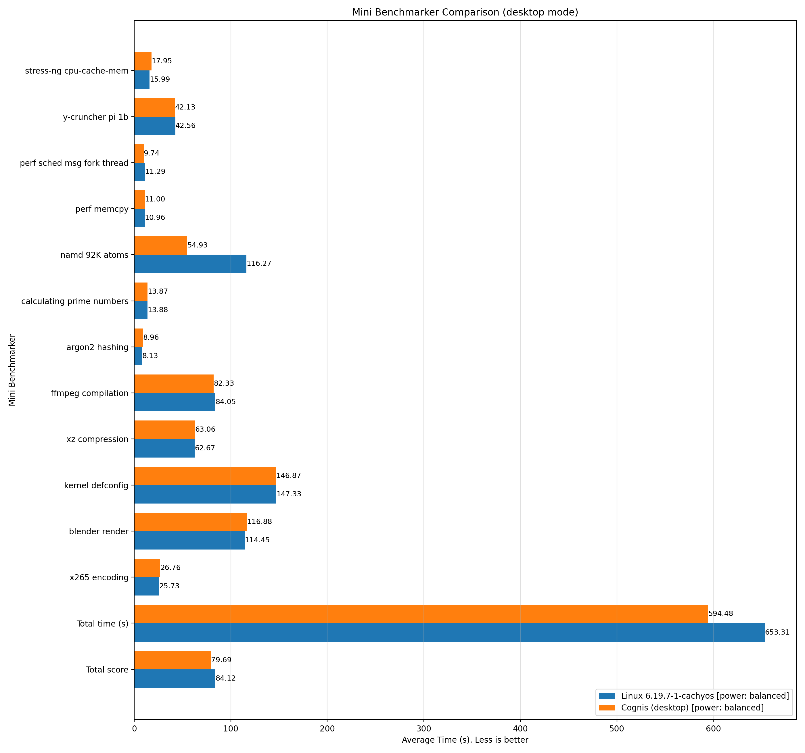

# scx_cognis

> [!WARNING]
> This branch is an experimental Cognis v3 lab, not a stable or release-ready
> branch. It is where redesign work happens before anything is considered for
> `main` or a future upstream PR.

`scx_cognis` is a BPF-first `sched_ext` scheduler aimed at desktops, workstations, and general-purpose servers.

Cognis keeps the normal scheduling path in BPF. Rust remains in the process for loading the scheduler, exporting stats, handling restart/reporting, driving the optional TUI, and servicing an opt-in compatibility fallback when work intentionally crosses into userspace.

## Table of Contents

- [Status](#status)
- [Design](#design)
- [Profiles](#profiles)
- [Production Ready?](#production-ready)
- [Safety Model](#safety-model)
- [Build and Run](#build-and-run)
- [Install and Remove](#install-and-remove)
- [Observability](#observability)
- [Benchmark Helpers](#benchmark-helpers)
- [Limitations](#limitations)
- [Contributing](#contributing)
- [License](#license)
- [Inspirations and References](#inspirations-and-references)

## Status

- Runtime model: BPF-first `sched_ext` scheduler with a Rust control plane
- Common path: direct local dispatch for immediate CPU placements, then a scheduler-owned stealable per-CPU deferred tier for ordinary busy-path work
- Default install profile: `desktop`
- Optional profile: `server`
- Userspace fallback still exists for compatibility, but it is now an explicit opt-in path instead of part of the default service runtime
- Local verification on this branch includes `cargo fmt --all -- --check`, `cargo check --locked`, `cargo test --locked`, `sh -n install.sh`, `sh -n uninstall.sh`, `sh -n cognis_benchmark.sh`, `bash -n mini_benchmarker.sh`, and `bash -n install_benchmark_deps.sh`
- CI covers Ubuntu format/test/build plus Arch and CachyOS compile checks, including shell syntax checks for the benchmark helpers and benchmark bootstrap script

This repository is still experimental scheduler work. Passing builds and unit tests are necessary, but they do not prove compositor stability, gaming smoothness, watchdog safety, or long-session behavior on your exact machine.

## Design

The kernel-facing policy lives in [main.bpf.c](main.bpf.c). The Rust control plane lives in [src/main.rs](src/main.rs) and [src/bpf.rs](src/bpf.rs).

At a high level, Cognis works like this:

1. `ops.select_cpu` and `ops.enqueue` try to keep ordinary work in BPF.
2. Immediate placements dispatch straight to the kernel local DSQ. Ordinary busy-path work currently uses a scheduler-owned stealable per-CPU deferred tier, while the shared DSQ is reserved for the opt-in userspace compatibility path.
3. Dispatch ordering is still deadline-based and bounded by profile slice and wake-credit knobs.
4. When the local deferred tier is empty, Cognis first tries local consume, then remote per-CPU steals, and only then falls back to the current-task refill behavior.
6. Rust stays available for restart control, stats, TUI, and the opt-in compatibility fallback path.
7. If `sched_ext` disables Cognis at runtime, Cognis now fails open to the kernel scheduler instead of treating that exit like a restart request.
8. In headless no-fallback periods, the Rust control loop now backs off more aggressively and no longer boosts its own userspace priority by default.
9. Cognis still carries an experimental BPF-side dispatch-progress guard, but local validation under `cachyos-benchmarker` has not yet shown it reliably preempting the kernel watchdog path under RT-heavy pressure.

> [!IMPORTANT]
> - The common case is meant to avoid a Rust round-trip.
> - `nr_queued`, `nr_scheduled`, and `nr_user_dispatches` are compatibility-fallback signals. They are only expected to move when `--userspace-fallback` is enabled; otherwise they should stay at zero.
> - `nr_local_dispatches` and `nr_shared_dispatches` are the most meaningful routing counters for the current reduced phase-1 branch.
> - `nr_llc_dispatches`, `nr_node_dispatches`, `nr_xllc_steals`, and `nr_xnode_steals` are older hierarchy counters that are expected to stay at zero while the reduced phase-1 path is active.
> - `slice(base/assigned)` in the monitor is not a live trace of every BPF dispatch slice: `base` is the active profile ceiling, while `assigned` tracks the userspace-fallback slice estimate.
> - The Rust loop is no longer meant to spin continuously when BPF is handling the workload.
> - Headless no-fallback operation now uses a quieter backoff and does not raise the Cognis userspace thread to `nice -20` by default.
> - Rust-side scheduler tables are fixed-capacity and allocated once at startup, while the BPF side uses bounded DSQs plus per-task local storage.
> - The TUI and monitor are observability tools, not the scheduling engine itself.

## Profiles

Cognis exposes two profiles. Both use the same BPF hierarchy; `desktop` is tuned for faster wake responsiveness and longer locality retention, while `server` reaches broader spill tiers sooner and uses steadier throughput-oriented balancing under pressure.

| Profile | Default slice ceiling | Default min slice | Wake behavior | Saturated-path bias |
|:--|:--|:--|:--|:--|
| `desktop` | `1000 µs` | `250 µs` | stronger wake responsiveness | favors local, LLC, and nearby-domain retention before broader spill |
| `server` | `8000 µs` | `1000 µs` | less wake-sync bias | currently shares the reduced phase-1 queue model while keeping different slice defaults |

The active profile is selected with:

```bash
scx_cognis --mode desktop
scx_cognis --mode server
```

`install.sh` writes `--mode desktop` by default unless you override it with `--flags`.

## Production Ready?

Conditionally.

For a validated target machine and workload mix, Cognis can be used as a production scheduler: the normal scheduling path stays in BPF, the optional Rust fallback stays off by default, and the install default is the `desktop` profile.

However, this project does not claim a blanket "production ready on every machine" guarantee across all kernels, topologies, desktop stacks, and server environments. The honest bar is:

- `desktop` mode: production-ready when you have validated it on the target machine and workload mix
- `server` mode: maintained as a first-class profile, but still needs the same workload-specific validation before calling it production-ready for a server deployment

## Safety Model

Cognis is written to be safe for long-running use, but this README deliberately avoids claiming a formal 24/7 guarantee that has not been proven with external verification.

What the current code does:

- Keeps the hot scheduling policy in BPF with fixed-size per-task storage and bounded queue domains
- Keeps scheduler-owned Rust tables fixed-capacity and allocated during startup instead of growing on demand on the hot path
- Avoids shared mutable global scratch buffers in the BPF bridge
- Treats malformed ring-buffer messages and topology-probe failures as recoverable conditions with safe fallbacks
- Keeps `desktop` as the install default while preserving a real `server` mode instead of a neglected side path
- Treats watchdog / runnable-task-stall exits as non-restartable failures so the system stays on the kernel scheduler instead of bouncing straight back into Cognis
- Carries an experimental BPF-side dispatch-progress guard, but local validation has not yet shown it reliably preempting the kernel watchdog window under RT-heavy pressure

What still requires real-machine validation:

- compositor stability
- browser benchmark frame pacing
- long-session thermal and power behavior
- watchdog behavior across kernel versions

## Build and Run

### Runtime Requirements

For normal plug-and-play use with the installer or a release binary, Cognis needs:

- Linux with `sched_ext` support
- `x86_64`: `install.sh` can download a prebuilt release binary
- other architectures: use `install.sh --build-from-source`

You can check whether the running kernel exposes `sched_ext` with:

```bash
grep CONFIG_SCHED_CLASS_EXT /boot/config-$(uname -r)
```

Non-developer users do not need to install Rust manually for the default `x86_64` install path. `sudo sh install.sh` downloads a release binary and sets up the service for you.

### Build from Source Requirements

If you want to compile Cognis locally, you need:

- a Rust toolchain
- common BPF build dependencies such as `clang`, `llvm`, `libbpf`, `libelf`, `zlib`, `libseccomp`, and `pkg-config`

### Build from Source

```bash
git clone https://github.com/galpt/scx_cognis
cd scx_cognis
cargo build --release
```

The release binary will be at `target/release/scx_cognis`.

### Run in the foreground

```bash
sudo ./target/release/scx_cognis --mode desktop
```

### Run in `server` mode

```bash
sudo ./target/release/scx_cognis --mode server
```

### Selected command-line options

| Option | Current behavior |
|:--|:--|
| `--mode <desktop\|server>` | Selects the active BPF profile |
| `-s, --slice-us <N>` | Overrides the profile slice ceiling in microseconds |
| `-S, --slice-us-min <N>` | Overrides the profile minimum slice in microseconds |
| `-l, --percpu-local` | Forces explicit per-CPU dispatch for userspace-fallback tasks |
| `-p, --partial` | Only manages tasks already using `SCHED_EXT` |
| `-v, --verbose` | Enables verbose output |
| `-t, --tui` | Launches the TUI dashboard |
| `--stats <secs>` | Runs the scheduler and periodic stats output together |
| `--userspace-fallback` | Re-enables the legacy userspace compatibility fallback path for diagnostics or compatibility testing |
| `--serve-stats` | Serves live stats to external monitor clients while the scheduler runs |
| `--monitor <secs>` | Monitor-only mode; does not launch a scheduler |
| `--help-stats` | Prints descriptions for exported statistics |
| `-V, --version` | Prints the Cognis version and `scx_rustland_core` version |

Only one `sched_ext` scheduler instance should be active at a time. If you installed Cognis as a service, stop that service before launching a foreground or TUI instance.

> [!NOTE]
> The TUI is for diagnostics, not for unattended 24/7 operation. For long-running use, run Cognis headless and treat `--tui` as a short interactive inspection tool.

## Install and Remove

The repository includes helper scripts for service-based installation and cleanup.

### Install

[install.sh](install.sh) can:

- download a GitHub release for `x86_64`, or build locally with `--build-from-source`
- detect CachyOS, Arch, Ubuntu, Debian, and fall back to a generic systemd path
- check for `sched_ext` support and warn when it cannot confirm it
- write or reuse `scx.service`
- manage `/etc/default/scx`
- default the installed service to `--mode desktop`
- enable and restart the scheduler service

Common examples:

```bash
sudo sh install.sh
sudo sh install.sh --dry-run
sudo sh install.sh --build-from-source
sudo sh install.sh --version vX.Y.Z
sudo sh install.sh --flags "--mode server --verbose"
sudo sh install.sh --flags "--mode desktop --serve-stats"
```

On CachyOS and Arch, the installer will use `scx-manager` when available and fall back to its own service setup when needed.

### Uninstall

[uninstall.sh](uninstall.sh) can:

- stop and disable `scx.service`
- restore or clean up `/etc/default/scx`
- remove `/usr/bin/scx_cognis`
- optionally purge the service file when it looks installer-owned

Common examples:

```bash
sudo sh uninstall.sh
sudo sh uninstall.sh --dry-run
sudo sh uninstall.sh --purge
sudo sh uninstall.sh --force
```

## Observability

Cognis exports live stats and can render a ratatui dashboard.

Available surfaces:

- `scx_cognis --monitor 1.0`
- `scx_cognis --stats 1.0`
- `scx_cognis --tui`
- `scx_cognis --help-stats`

The default headless service path does not launch the stats server anymore and
does not enable the legacy userspace fallback path. If you want to attach
`--monitor` to a long-running installed service, start that service with
`--serve-stats`, for example:

```bash
sudo sh install.sh --flags "--mode desktop --serve-stats"
```

What the main counters mean:

- `nr_kernel_dispatches`: total tasks handled directly by the BPF scheduler
- `nr_local_dispatches`: BPF routes that stayed on an immediate local DSQ or the shallow scheduler-owned per-CPU deferred tier
- `nr_llc_dispatches`: older hierarchy counter; expected to stay at zero in the reduced phase-1 path
- `nr_node_dispatches`: older hierarchy counter; expected to stay at zero in the reduced phase-1 path
- `nr_shared_dispatches`: BPF routes that went to the shared compatibility/fallback DSQ
- `nr_xllc_steals`: older hierarchy counter; expected to stay at zero in the reduced phase-1 path
- `nr_xnode_steals`: older hierarchy counter; expected to stay at zero in the reduced phase-1 path
- `nr_user_dispatches`: tasks that crossed into the userspace compatibility fallback
- `nr_queued` / `nr_scheduled`: current compatibility-fallback backlog
- `slice(base/assigned)`: profile slice ceiling plus userspace-fallback assigned-slice estimate, not a direct per-task BPF slice trace
- `sched_p50/p95/p99`: userspace fallback latency percentiles, not full-system frame-time metrics

If `--userspace-fallback` is off, `nr_user_dispatches`, `nr_queued`, and `nr_scheduled` should stay at zero. If they stay elevated when the fallback is enabled during a workload that should fit the BPF fast path, that is a signal to investigate the BPF policy rather than a sign that the userspace path is “working as intended.”

If `nr_shared_dispatches` climbs during a workload that should stay on the BPF-owned path, that is a hint that the branch is still leaning on the compatibility/fallback side more than intended.

## Benchmark Helpers

The repository includes two local benchmark helpers:

- [cognis_benchmark.sh](cognis_benchmark.sh) for interactive Aquarium plus `stress-ng` responsiveness checks
- [mini_benchmarker.sh](mini_benchmarker.sh) for automated Mini Benchmarker baseline-vs-Cognis runs with chart generation

### `cognis_benchmark.sh`

This script is an interactive comparison helper, not a source of authoritative benchmark claims. It:

- opens the WebGL Aquarium benchmark
- runs three `stress-ng` phases
- asks you to compare throughput, frame pacing, and visible jank between baseline and Cognis

Current phase layout:

1. CPU stress
2. I/O stress
3. Mixed CPU + VM pressure

### `mini_benchmarker.sh`

This script automates a heavier CPU-focused comparison around the external [Mini Benchmarker](https://gitlab.com/torvic9/mini-benchmarker) tool. It:

- runs Mini Benchmarker once with Cognis stopped and labels that baseline with the detected kernel release, such as `Linux 6.19.7-1-cachyos`
- runs Mini Benchmarker again with `scx_cognis --mode desktop` or `--mode server`
- copies and tags the produced `benchie_*.log` files
- generates `mini_benchmarker_comparison.png`, `mini_benchmarker_comparison.svg`, and `mini_benchmarker_summary.csv`

> [!IMPORTANT]
> - all reported Mini Benchmarker values are elapsed time in seconds, so lower is better
> - the wrapper is distro-agnostic, and it can report missing prerequisites with `./mini_benchmarker.sh --check-deps`
> - `./mini_benchmarker.sh --check-deps` checks the wrapper, the scheduler binary, sudo availability, and the Mini Benchmarker runtime tools that the upstream script actually uses
> - Mini Benchmarker itself is still an external benchmark suite; [install_benchmark_deps.sh](install_benchmark_deps.sh) now fetches Vic's `mini-benchmarker.sh` into `~/.local/share/scx_cognis/mini-benchmarker/`, applies a local compatibility patch for GNU `time` lookup, and installs common package dependencies on a best-effort basis
> - the default executable lookup checks that local install first, then `mini-benchmarker.sh` in `PATH`, with `MINI_BENCHMARKER_CMD` or `--mini-cmd` as an override
> - chart generation uses `python3` plus `matplotlib`, and `./mini_benchmarker.sh --bootstrap-plotter` can create a local plotter virtualenv when needed
> - when tagged logs include `Power profile: ...`, the generated chart legend and summary CSV carry that metadata too
> - when benchmark orchestration needs root, the runner refreshes the sudo ticket once up front and keeps it alive during long benchmark phases instead of failing later on scheduler stop/start
> - benchmark bootstrap artifacts can be cleaned explicitly with `./install_benchmark_deps.sh --remove-all` or the narrower `--remove-*` flags
> - this is still local-machine benchmarking; it does not turn one run into a universal scheduler claim

Typical usage:

```bash
./mini_benchmarker.sh --check-deps
./install_benchmark_deps.sh --mini-benchmarker --plotter
./mini_benchmarker.sh --mode desktop
./mini_benchmarker.sh --mode server --runs 3 --bootstrap-plotter
./install_benchmark_deps.sh --remove-all
```

> [!NOTE]
> Run `./mini_benchmarker.sh` as your normal user, not with `sudo`. The runner now prompts once for sudo when it needs to stop or start Cognis and keeps that ticket alive during the benchmark. Running the whole script with `sudo` changes `HOME`, puts Mini Benchmarker assets under `/root/...`, and can leave root-owned benchmark leftovers behind. If you hit a permission error for `benchmark-results`, fix the checkout ownership or pass `--results-dir` to a writable location.

If you want benchmark numbers you can trust on your hardware, keep the environment fixed, run both schedulers multiple times, and compare repeated local runs rather than relying on one-off impressions.

### Example Result: Ryzen 7 6800H Laptop

The repository includes one committed Mini Benchmarker example under [benchmark-results/examples/ryzen-7-6800h-cachyos-kde-desktop](benchmark-results/examples/ryzen-7-6800h-cachyos-kde-desktop). It is included as a real output sample, not as a blanket claim about Cognis on all machines.

Machine used for this example:

- CPU: `AMD Ryzen 7 6800H with Radeon Graphics`
- RAM: `64 GiB DDR5-4800`
- distro / desktop: `CachyOS` with `KDE Plasma 6.6.3`
- baseline kernel: `Linux 6.19.7-1-cachyos`
- power profile: `balanced`
- Cognis mode: `desktop`
- runs per variant: `1`

Result snapshot from the committed example:

| Variant | Total time (s) | Total score |
|:--|--:|--:|
| `Linux 6.19.7-1-cachyos` | `653.31` | `84.12` |
| `Cognis (desktop)` | `594.48` | `79.69` |

In this particular run, `Cognis (desktop)` finished faster overall than the baseline kernel. All values in the chart are elapsed time in seconds, so shorter bars and smaller numbers are better. The full chart and raw tagged logs are committed so the result stays inspectable instead of being summarized loosely.



## Limitations

- Cognis is BPF-first, but it is not yet a pure single-language BPF scheduler with no Rust control process.
- The current implementation still uses `scx_rustland_core` as its userspace scaffold.
- CI cannot prove compositor stability, gaming smoothness, or watchdog safety on GitHub-hosted runners.
- Runtime behavior still depends heavily on kernel version, topology, firmware, browser workload, GPU/compositor stack, and desktop/server load mix.
- The current mitigation for watchdog-triggered `sched_ext` exits is fail-open behavior, not a claim that the entire stall class has been eliminated.
- Local `cachyos-benchmarker` repros still show a runnable-task-stall watchdog edge case under heavy RT-class pressure. That remains an active follow-up item rather than a solved claim.
- Any claim of “better” behavior should come from repeated testing on the target machine.

## Contributing

Changes are most useful when they keep the BPF policy understandable, bounded, and easy to benchmark.

Before sending a change, it is a good idea to run:

```bash
cargo fmt --all -- --check
cargo check --locked
cargo test --locked
sh -n install.sh
sh -n uninstall.sh
sh -n cognis_benchmark.sh
bash -n mini_benchmarker.sh
bash -n install_benchmark_deps.sh
```

If a change alters CLI behavior, profiles, exported stats, install scripts, workflows, or scheduler behavior documented here, update this README in the same patch.

## License

This project is licensed under `GPL-2.0-only`. See [LICENSE](LICENSE).

## Inspirations and References

These references informed Cognis' design and evaluation mindset, especially around deadline ordering, bounded wake credit, locality-aware hierarchy design, BPF-owned hot paths, and disable/fallback handling. They are inspirations and reference points, not a claim that Cognis automatically reproduces each cited paper's or project's published results.

### Papers

1. Linux kernel documentation. (n.d.). *EEVDF Scheduler*. https://docs.kernel.org/scheduler/sched-eevdf.html
2. Duda, K. J., & Cheriton, D. R. (1999). *Borrowed-virtual-time (BVT) scheduling: Supporting latency-sensitive threads in a general-purpose scheduler*. Proceedings of the 17th ACM Symposium on Operating Systems Principles. https://web.stanford.edu/class/cs240/old/sp2014/readings/duda99borrowed.pdf
3. Agrawal, K., & Sukha, J. (2011). *Hierarchical scheduling for multicores with multilevel cache hierarchies*. Washington University in St. Louis, Department of Computer Science and Engineering. https://openscholarship.wustl.edu/cse_research/66/
4. Wang, J., Trach, B., Fu, M., Behrens, D., Schwender, J., Liu, Y., Lei, J., Vafeiadis, V., Härtig, H., & Chen, H. (2023). *BWoS: Formally verified block-based work stealing for parallel processing*. 17th USENIX Symposium on Operating Systems Design and Implementation (OSDI 23). Used here as a steal-policy and hierarchy reference point rather than as a Linux CPU-scheduler blueprint. https://www.usenix.org/conference/osdi23/presentation/wang-jiawei

### Reference Schedulers

1. sched-ext maintainers. (n.d.). *scx_bpfland* [Software]. GitHub. https://github.com/sched-ext/scx/tree/main/scheds/rust/scx_bpfland
2. sched-ext maintainers. (n.d.). *scx_beerland* [Software]. GitHub. https://github.com/sched-ext/scx/tree/main/scheds/rust/scx_beerland
3. sched-ext maintainers. (n.d.). *scx_lavd* [Software]. GitHub. https://github.com/sched-ext/scx/tree/main/scheds/rust/scx_lavd
4. sched-ext maintainers. (n.d.). *scx_cake* [Software]. GitHub. https://github.com/sched-ext/scx/tree/main/scheds/rust/scx_cake
5. sched-ext maintainers. (n.d.). *scx_layered* [Software]. GitHub. Referenced directly in Cognis' disable-path comments and fallback handling pattern. https://github.com/sched-ext/scx/tree/main/scheds/rust/scx_layered
6. sched-ext maintainers. (n.d.). *scx_rustland_core* [Software]. GitHub. Current Cognis still uses this crate as its userspace scaffold rather than reimplementing the loader/control-plane substrate from scratch. https://github.com/sched-ext/scx/tree/main/rust/scx_rustland_core
